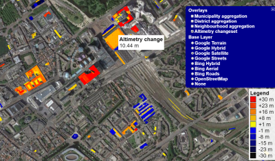
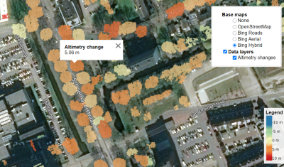

PointCloudTools
============

Massive airborne laser altimetry (ALS) point cloud and digital elevation model (DEM) processing library.  
The toolset supports change detection of the built-up area and vegetation, tested primarily on the study dataset [AHN - Actueel Hoogtebestand Nederland](http://www.ahn.nl/).

Build and install
------------

The project is continuously built and tested on Windows 10/11 and Ubuntu 20.04/22.04 LTS.  
See the [Build instructions](BUILD.md) for a detailed guide.

Demo
------------

An interactive visualization of changes in buildings and vegetation for the Dutch AHN point clouds is available at:  
**https://gis.inf.elte.hu/ahn/**

Publications
------------

* Máté Cserép, Roderik Lindenbergh: *Distributed processing of Dutch AHN laser altimetry changes of the built-up area*, International Journal of Applied Earth Observation and Geoinformation, Vol. 116 , Article 103174, 2023, [DOI: 10.1016/j.jag.2022.103174](https://doi.org/10.1016/j.jag.2022.103174)
* Anett Fekete, Máté Cserép *Tree segmentation and change detection of large urban areas based on airborne LiDAR*, Computers & Geosciences, Vol. 156 , Article 104900, 2021, [DOI: 10.1016/j.cageo.2021.104900](https://doi.org/10.1016/j.cageo.2021.104900)

Contributing
------------

Please read [CONTRIBUTING.md](CONTRIBUTING.md) for details on coding conventions.

License
------------

This project is licensed under the BSD 3-Clause License - see the [LICENSE](LICENSE) file for details.
